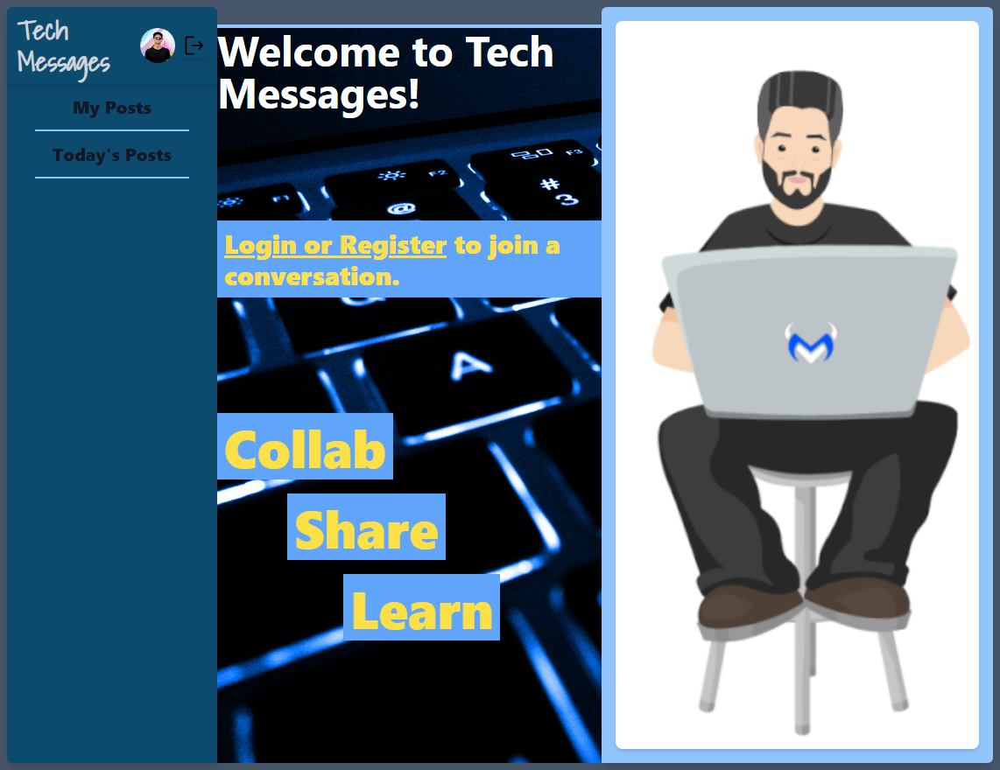

# Tech Messages

  
## Table of Contents

* [Description](#description)
* [Installation](#installation)
* [Usage](#usage)
* [Contribution](#contribution)
* [Testing](#testing)
* [Questions](#questions)
* [Licensing](#licensing)

## Description

Tech Messages is a forum application that enables registered users to perform actions such as creating, deleting, replying, and modifying their posted messages. The focus of this app was to develop a functional forum with emphasis on backend development. The user information and passwords are stored in a MySQL database, encrypted with Bcrypt, along with their corresponding main threads and posts.

The app utilizes Sequelize for database queries, Express for routing and API requests, and Handlebars for HTML templating. Initially, I thought Handlebars was as a basic templating tool with limited dynamic page creation capabilities. However, with further exploration, it has revealed more techniques for creating dynamic pages, leading to several code refactoring instances.

At present, the app lacks password recovery functionality and the search bar is still a work in progress. Also, it's worth noting that the delete button does not have confirmation yet, so be careful when using it.

Deployed Project: https://polar-plateau-51344.herokuapp.com/

 
  
  
        
  

 

## Installation

To run Sequelized E-Commerce Back-end locally you'll need to first install Node and then install the following modules:

- bcrypt    v5.0.0
- dotenv    v8.2.0
- express   v4.17.1
- mysql2    v2.1.0
- sequelize v5.21.7
- express-handlebars v5.2.0
- nodemon (recommended)

- Insomnia for testing queries

## Usage

As a non-registered user you can only view threads and posts. Once logged in the sidenav has links for the homepage by clicking the title, posts created by the user via 'My Posts', and other users posts via 'Today's Posts.

To create a new thread click the create button next to the search bar and the right panel will display a title field and post-content field. Click 'create it' once satisfied with the post.

Replying, Modifying and Deleting posts is done in the right panel once a main thread has been seleted.

GitHub Project
Create the database:
- Navigate to the project's root folder, open a terminal, and log into mysql: **mysql -u root -p**
- Then create the database using the db/schema.sql: **source db/schema.sql**

Seed and start the database:
- From another terminal seed the database by running the command: **npm run seed**

## Contribution

Follow the "fork-and-pull" Git workflow.

  1. **Fork** the repo on GitHub
  2. **Clone** the project to your own machine
  3. **Commit** changes to your own branch
  4. **Push** your work back up to your fork
  5. Submit a **Pull request** so that we can review your changes

NOTE: Be sure to merge the latest from "upstream" before making a pull request!

## Testing
  
N/A

## Questions

Feel free to contact me with any questions or comments:  
<donovan.courtney@gmail.com>  
<https://github.com/decourtney>

## Licensing

Code and Docs released under [MIT License](https://choosealicense.com/licenses/mit/).
